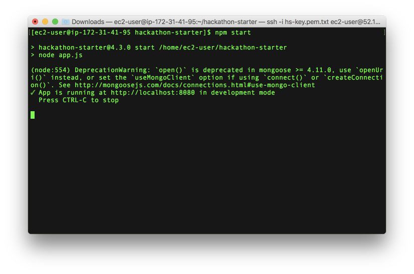

# Installing The Essentials on EC2
Three things will need to be installed on the EC2 instance:

1. Git
2. Node.js
3. MongoDB

The first thing to do is ensure the platform is updated. This can be done by running the following command into the PuTTY terminal window:

```
sudo apt-get update
```


If prompted to continue, enter "Y" and press enter to advance the installer. In the above picture, the installer automatically started, but you may be asked to enter "Y".

## Git

First, you must install Git. This can be done by running the following command within the EC2 instance (the PuTTY terminal window):

```
sudo apt-get install git
```

Again, it may prompt you to confirm during the installation step. This can be done by entering "Y" and pressing the enter key. After git is successfully installed, it's time to clone the hackathon-starter repo you will be using in this course. Earlier, you have forked the original project onto your GitHub account. You now want to clone that repository onto the EC2 server. This can be done by running the following command. Be sure to change "yourUserName" in the below URL to your Github username:

```
git clone https://github.com/yourUserName/hackathon-starter.git
```
The git repo will now be on the EC2 server. If you want to view the folders and files on the computer, run the following command:

```
ls
```

Next, move into the hackathon-starter directory by running the following command:

```
cd hackathon-starter
```


## Node.js

Next, run the following commands to download and install Node.js:

```
curl -sL https://deb.nodesource.com/setup_12.x | sudo -E bash -
```
Then run:

```
sudo apt-get install -y nodejs
```

Node and npm should now be installed. This can be verified by running the following to commands to test if Node and npm are installed:
Node:
```
node -v
```
> IMPORTANT NOTE: If you verify you have version 12 SKIP PAST THIS PART, if you run the node -v command and the version shows any version other than versions 12.?.? (minor versions don't matter) then you npm install commad at the end will throw errors.  You must use node version 12.

- If it installs a higher version of node between `14.?.? - 16.?.?` then you will need to use `nvm` to switch node versions back down to `12`. 


- Here's how:

- run:
```
curl -o- https://raw.githubusercontent.com/nvm-sh/nvm/v0.39.0/install.sh | bash
```
- Then run to verify nvm installed:
```
command -v nvm
```

- you should see the output `nvm`, this means it installed properly:

- Next run: 
```
nvm install 12
```
- lastly run the following command again to verify you have node version 12 installed:
- Node:
```
node -v
```

- You should see the output of 
`v12.?.?` (the minor versions don't matter)

**⬇ skip to here is you have version 12.?.? of node**
npm:
```
npm -v
```


Once verified, run the following command to install the dependencies that the web application needs to run:

```
npm install
```


# Installing MongoDB

Now it's time to install MongoDB. Run the following commands to install and configure MongoDB:

```
sudo apt-key adv --keyserver hkp://keyserver.ubuntu.com:80 --recv 0C49F3730359A14518585931BC711F9BA15703C6
```

Then run:

```
echo "deb [ arch=amd64,arm64 ] http://repo.mongodb.org/apt/ubuntu xenial/mongodb-org/3.4 multiverse" | sudo tee /etc/apt/sources.list.d/mongodb-org-3.4.list
```
Now, run:

```
sudo apt-get update
```

Lastly, run:

```
sudo apt-get install -y mongodb-org
```
MongoDB should now be installed. To start the database, run the following command:

```
sudo service mongod start
```

The database should now be running. But how do can one check if it is? Fortunately, the MongoDB database will write all actions to a file, including if it's running and on which port. By using the cat command (shown below), the contents of the file will be printed to the console without having to open it in a text editor.

```
cat /var/log/mongodb/mongod.log
```

## MongoDB Running:
MongoDB is running if the last line reads, *"[initandlisten] waiting for connections on port 27017".*


>**DO NOT RUN THE FOLLOWING COMMAND, THIS IS JUST TO SHOW YOU HOW TO STOP MONGODB**

## MongoDB Stopped:
If you would like to stop the database, you can run the following command, but for now, do NOT stop Mongo:

```
sudo service mongod stop
```

## Run the App!

Now that the MongoDB server is running, it's time to run the application itself. Within the `hackathon-starter` directory (in the PuTTY terminal window still), run the application by running the following command:

```
npm start
```

### Node Running:

>TIP: Your terminal window may appear different depending on your version.

If you navigate back to your Amazon console, you will be able to view the web application by locating the Public DNS(IPv4) URL.

## Locate public DNS:
When looking at your running instances, find the *"Public DNS (IPv4) URL"* shown in the picture below:


Copy and paste this value into the browser and append `:8080` at the end. For example, the link for the web application displayed in the image above is: `ec2-52-14-202-248.us-east-2.compute.amazonaws.com:8080`. The `:8080` at the end of the URL is a port and is necessary to include as the web application running on EC2 is running on port 8080.

## Hackathon Starter Homepage:


*You've successfully launched a web application on EC2. Remember to shut down your database and stop the server if you're finished.*

*That's it! You've learned a lot in this lesson, so be sure to practice by launching another EC2 instance. By the end of this course, you should understand how to create a new EC2 instance with confidence.*


#### Please reach out to yuo mentors if you need help. 